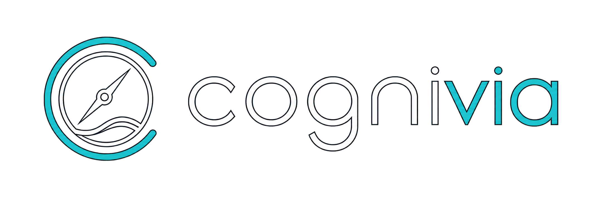

<p align="center">
  
</p>

# Cognivia

## Evidence-Guided AI Learning Decision Application

Evidence-guided AI learning decision application built with Python, RAG, and
LangGraph to turn noisy learning questions into evidence-aware next steps.

Designed around bounded LLM workflows, explicit evidence states,
deterministic fallbacks, and engineering reliability—helping people make
better learning decisions without replacing human judgment.

**Python · RAG · LangGraph · Streamlit · Evaluation & Reliability · Pytest · GitHub Actions**

## Engineering Highlights

- Bounded LangGraph orchestration replaces open-ended autonomous loops with
  explicit routes and terminal outcomes.
- Evidence-aware RAG separates retrieval relevance from direct support,
  exposes low-support states, and can return `insufficient_evidence` instead
  of forcing an answer.
- Deterministic fallbacks and explicit retrieval, provider, and evidence
  failure states keep degraded behavior visible.
- 500+ automated tests cover UI, orchestration, retrieval, provider, memory,
  and security paths; GitHub Actions runs the offline suite and Ruff in CI.

## Project Status

Cognivia is a functional, locally validated MVP under active development. The
current version demonstrates its core decision workflow, evidence-aware RAG,
bounded LangGraph orchestration, explicit fallback behavior, automated
testing, and CI.

It is not presented as a production-ready or multi-user service.

### Next priorities

These roadmap items are planned, not implemented:

- Deploy a reproducible public demo with appropriate usage and security
  controls.
- Introduce user accounts and durable user profiles.
- Extend learner continuity with production-ready long-term memory.
- Continue focused UI and accessibility improvements.

See [Future Improvements and To-do](docs/future-improvements.md) for the
maintained broader roadmap.

> **Public history:** Cognivia was initially developed in a private repository.
> This public repository begins with a sanitized baseline rather than a copy of
> that private commit history. The earlier technical progression is summarized
> in [Engineering History](docs/engineering-history.md).

## The problem Cognivia addresses

AI learners face an overload of tools, topics, frameworks, role labels, and
generic recommendations. A fluent answer alone does not show whether a goal
was understood, whether evidence directly supports a recommendation, whether
the request is outside the available evidence, or what the learner should
reflect on before acting.

Cognivia treats this as a learning-decision workflow rather than a one-shot
answer-generation task. It helps a learner clarify the question, inspect the
strength and limits of available evidence, choose a direction, and retain
authority over the decision.

## What it does

The current application provides three modes:

- **Noise-to-Signal Agent** — retrieves local learning evidence, identifies
  ambiguity, and produces an answer, clarification, comparison, or learning
  plan.
- **AI Skill Compass** — helps frame skill-development questions.
- **Interview Coach** — supports structured interview practice.

The primary Noise-to-Signal flow routes vague or context-only goals to guided
intake and uses a direct-decision path for clear requests. It includes quick
prompts, a Focus Mode, source-aware responses, and exportable notes or learning
plans. Where a configured provider can create embeddings, it retrieves from the
bundled knowledge base through local Qdrant. Retrieval relevance is not treated
as direct support: the graph separately assesses whether evidence supports the
request and can return low-evidence or out-of-scope outcomes. Provider behavior
and capability differ by configuration. Optional PostgreSQL-backed learner
memory is append-only; without a database URL, the null store provides no
durable history.

## How the primary workflow works

1. The learner enters a goal or question directly or through guided intake.
2. The bounded application graph shapes the request and decides whether
   retrieval is needed.
3. When provider configuration supports embeddings, RAG retrieves from
   `data/knowledge_base/` through local Qdrant.
4. The graph treats retrieval relevance as a candidate filter, then separately
   checks whether the evidence directly supports the request.
5. The workflow can answer, ask for clarification, produce a focused plan,
   compare supported options, or return an insufficient-evidence outcome.
6. The learner can inspect the evidence state, select a learning path, save a
   Study note, and export reflection or learning-plan material.

The graph is bounded: an insufficient first retrieval can trigger one query
reformulation and one retry. It is not an open-ended autonomous agent.

## Why Cognivia, not ChatGPT?

General-purpose LLMs provide broad language and reasoning capabilities.
Cognivia does not try to replace them as general assistants; it provides a
bounded methodology around their use for learning decisions. Goal
clarification, explicit evidence states, learning paths, reflection, runtime
transparency, and learner authority are product responsibilities rather than
properties supplied by a model alone.

See [Why Cognivia and Not Just ChatGPT?](docs/product/why-cognivia-not-chatgpt.md)
for the fuller product rationale.

## Capabilities and boundaries

Implemented in the current repository:

- a Streamlit application with Noise-to-Signal Agent, AI Skill Compass, and
  Interview Coach modes;
- guided intake, direct-query routing, quick prompts, Focus Mode, and new-search
  reset behavior;
- bounded LangGraph orchestration with explicit answer, clarification, plan,
  comparison, and insufficient-evidence outcomes;
- recursive Markdown/PDF loading, token-aware chunking, heading and provenance
  metadata, local Qdrant retrieval, relevance filtering, and direct-support
  assessment;
- selectable learning paths, next-step guidance, Study notes, and Markdown or
  JSON exports, including a full learning-plan Markdown export;
- explicit `offline`, `openai`, and `openrouter` provider modes; and
- an optional append-only PostgreSQL learner-memory foundation with a null
  fallback when durable storage is not configured.

Important limits:

- Offline mode demonstrates local UI and deterministic workflow paths, but it
  is not provider-backed RAG and cannot create or query the embedding index.
- Provider capabilities and behavior are not equivalent across configurations.
- Retrieval relevance does not prove direct support, and Cognivia does not
  eliminate hallucinations or guarantee factual certainty.
- The bundled corpus is curated and limited; legitimate questions can produce
  an insufficient-evidence outcome.
- Local Qdrant and the current memory foundation are suitable for local
  development, not proof of production-grade index integrity or multi-user
  persistence.
- Production hosting, authentication, authorization, privacy isolation,
  backups, rate limiting, scalability, and deployment hardening are not
  claimed.

## Run locally

Prerequisites:

- Python
- A virtual environment

```bash
python -m venv .venv
source .venv/bin/activate
pip install -r requirements.txt
COGNIVIA_LLM_PROVIDER=offline python -m streamlit run app.py
```

The offline command avoids OpenAI and OpenRouter model calls. It supports a
local UI and workflow demonstration, but it does not provide evidence-backed
retrieval because creating/querying the local index requires a configured
provider embedding key. Provider credentials and optional database settings are
documented in [`.env.example`](.env.example); never commit real secrets.

The setup command and current UI flow were not executed as part of this
documentation recovery. Runtime behavior therefore remains **PENDING manual
verification**.

## Demo and validation guidance

For an offline walkthrough, select **Noise-to-Signal Agent**, use guided intake
or a quick prompt, inspect the communicated uncertainty, enter and exit Focus
Mode, reset with **New search**, and inspect any offered note or learning-plan
export. These interaction outcomes remain expected rather than manually
verified in this recovery commit.

An evidence-backed RAG demonstration requires explicitly authorized OpenAI or
OpenRouter access with an embedding-capable key and may incur provider cost.
See the [demo guide](docs/demo-guide.md) for the conservative walkthrough and
[testing](docs/testing.md) for validation commands and current evidence limits.
No product test total or evaluation score is claimed here.

## Architecture

```text
Streamlit UI
    |
    v
Application graph ──> request shaping / routing
    |                         |
    v                         v
Local RAG                 provider boundary
    |
    v
Markdown/PDF knowledge base

Optional PostgreSQL memory sits behind the memory-store boundary.
```

Presentation, orchestration, retrieval, provider access, memory, persistence,
input hygiene, and evaluation are represented by distinct modules. `app.py`
remains the Streamlit composition root and still coordinates some workflow,
export, and persistence concerns. See
[`docs/architecture.md`](docs/architecture.md) for the verified component map.

## Documentation map

- [Architecture](docs/architecture.md)
- [Demo guide](docs/demo-guide.md)
- [Testing](docs/testing.md)
- [Evaluation](docs/evaluation.md)
- [Sources and provenance](docs/sources.md)
- [Product rationale: Why Cognivia and Not Just ChatGPT?](docs/product/why-cognivia-not-chatgpt.md)
- [Guided learning intake](docs/guided-learning-intake.md)
- [Future improvements](docs/future-improvements.md)
- [Engineering history](docs/engineering-history.md)
- [Project evolution](docs/project-evolution.md)

No test total or evaluation score is claimed here. Current validation status
and the commands used to establish it belong in the linked testing and
evaluation documents.

## Licensing

Cognivia source code is licensed under the [MIT License](LICENSE), copyright
(c) 2026 Antonio Serna Gutiérrez.

Project documentation remains copyrighted by Antonio Serna Gutiérrez unless a
document explicitly states otherwise. Brand, image, video, screenshot, and
other media assets are excluded from the MIT License and remain all rights
reserved unless explicitly stated otherwise. See
[Asset provenance](ASSET_PROVENANCE.md) for the project-owned asset boundary.

Third-party materials retain their original rights and licenses. See
[Third-party notices](THIRD_PARTY_NOTICES.md) for retained and excluded source
artifacts.
