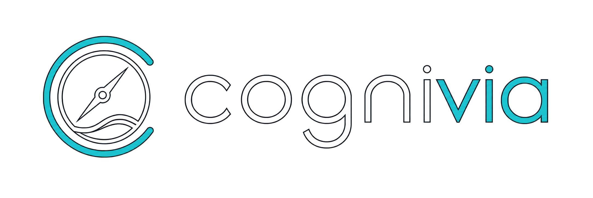
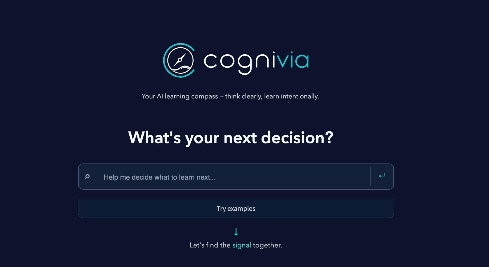
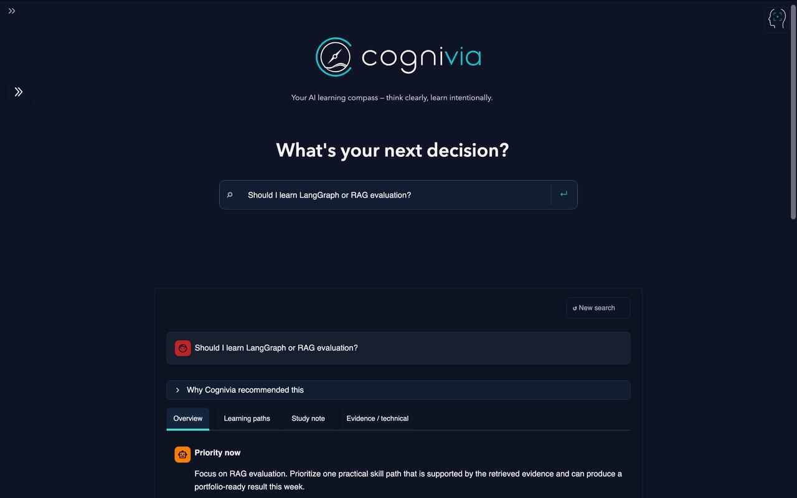

<p align="center">
  
</p>

# Cognivia

Cognivia is an evidence-guided AI learning decision application for people who
are unsure what to learn next. Built with Python, RAG, and LangGraph, it turns
vague goals and noisy recommendations into clearer, evidence-aware next steps.

Rather than acting as a generic chatbot, Cognivia uses bounded routing,
explicit evidence states, and deterministic fallbacks to clarify a learner's
goal, assess available support, and preserve human judgment.

**Python · RAG · LangGraph · Streamlit · Evaluation & Reliability · Pytest · GitHub Actions**

## Product preview

### Guided intake



### Evidence-guided recommendation



## Why this project matters

- Bounded orchestration replaces open-ended agent loops with explicit routes
  and terminal outcomes.
- Retrieval relevance identifies candidate material; a separate check decides
  whether that material directly supports the request.
- Insufficient evidence is an explicit outcome instead of a prompt to invent a
  confident answer.
- Retrieval and provider failures produce visible, deterministic fallback
  states.
- Guided intake helps users clarify vague goals while keeping the final
  decision in their hands.

## Engineering Highlights

- The LangGraph workflow uses explicit nodes, routes, retry limits, and
  terminal states that are straightforward to inspect and test.
- The RAG pipeline retains heading and provenance metadata while separating
  retrieval, relevance filtering, and direct-support assessment.
- Provider access, persistence, memory, and UI state sit behind defined
  boundaries with explicit degraded behavior.
- 593 automated tests passed in isolated offline verification on 5 October
  2026, covering UI state, orchestration, retrieval, providers, memory,
  security, and export paths; GitHub Actions runs the offline suite and Ruff in
  CI.

## The problem Cognivia addresses

AI learners face too many tools, topics, frameworks, and role labels, often
paired with generic recommendations and unclear evidence quality. The hard
part is deciding what to learn next and why that choice is justified.

Cognivia treats this as a decision workflow rather than a one-shot chat
answer: clarify the goal, assess the available evidence, expose uncertainty,
and help the learner choose a direction.

## Why Cognivia, not a general-purpose AI assistant?

General-purpose AI assistants and LLMs provide broad conversational reasoning
and are useful for one-off questions. Cognivia adds a structured
learning-decision workflow around those capabilities:

- goal clarification for vague requests;
- bounded routing with explicit terminal outcomes;
- evidence-state handling that distinguishes relevance from direct support;
- clarification and insufficient-evidence outcomes when support is weak; and
- learning paths, reflection, notes, and exports that keep the learner in
  control.

Cognivia complements general-purpose assistants by making the workflow,
evidence limits, and decision points explicit while keeping human judgment in
control.

See
[Product rationale: Why Cognivia beyond general-purpose AI assistants](docs/product/why-cognivia-not-chatgpt.md)
for the fuller product rationale.

## What it does

The application provides three modes, led by its primary decision workflow:

- **Noise-to-Signal Agent** — the primary mode for clarifying a learning goal,
  checking available evidence, and producing a recommendation, clarification,
  comparison, or focused plan.
- **AI Skill Compass** — helps frame skill-development questions.
- **Interview Coach** — supports structured interview practice.

Noise-to-Signal supports guided intake for vague goals and direct routing for
clear requests, with source-aware responses, selectable learning paths, Study
notes, and plan exports.

## How the primary workflow works

1. The learner enters a goal directly or uses guided intake.
2. The graph shapes and routes the request.
3. RAG retrieves relevant evidence when needed and supported by the configured
   provider.
4. The workflow assesses whether the retrieved material directly supports the
   request.
5. It returns a recommendation, clarification, comparison, focused plan, or
   insufficient-evidence state.
6. The learner can inspect the evidence, select a path, save notes, or export a
   plan.

The graph is bounded: one reformulation and one retry are allowed before the
workflow terminates.

> **Example:** “I don’t know what to learn next” → guided intake → goal
> clarification → evidence retrieval → support assessment → a learning
> direction and next step.

## Project Status

Cognivia is a functional MVP with its core decision workflow, evidence-aware
RAG, automated testing, and CI in place. Public deployment remains pending, and
the project is not presented as a production-ready or multi-user service.

### Next priorities

These roadmap items are planned, not implemented:

- Deploy a reproducible public demo with appropriate usage and security
  controls.
- Introduce user accounts and durable user profiles.
- Extend learner continuity with production-ready long-term memory.
- Continue focused UI and accessibility improvements.

See [Future Improvements and To-do](docs/future-improvements.md) for the
maintained broader roadmap.

## Capabilities and boundaries

Implemented:

- Noise-to-Signal, AI Skill Compass, and Interview Coach modes with
  guided/direct intake, quick prompts, Focus Mode, and search reset;
- bounded LangGraph answer, clarification, plan, comparison, and
  insufficient-evidence routes;
- Markdown/PDF ingestion with provenance-aware local Qdrant retrieval and
  separate relevance/direct-support checks;
- learning paths, next-step guidance, Study notes, and Markdown/JSON exports;
  and
- provider modes (`offline`, `openai`, `openrouter`) and optional append-only
  PostgreSQL learner memory with a null fallback.

Limits:

- Offline mode supports local UI and deterministic workflows, but cannot
  create/query the provider-backed embedding index.
- Provider capabilities differ. One OpenAI-backed retrieval flow was manually
  verified on 6 October 2026; broader live-provider behavior is not claimed.
- Retrieval relevance does not prove direct support or certainty; the limited
  curated corpus can yield insufficient evidence.
- Local Qdrant and learner memory support development, not production-grade
  index integrity or multi-user persistence.
- Production hosting, authentication, authorization, privacy isolation,
  backups, rate limiting, scalability, and hardening are not claimed.

## Run locally

Prerequisites:

- Python
- A virtual environment

```bash
python -m venv .venv
source .venv/bin/activate
pip install -r requirements.txt
COGNIVIA_LLM_PROVIDER=offline python -m streamlit run app.py
```

The offline command avoids OpenAI and OpenRouter model calls. It supports a
local UI and workflow demonstration, but it does not provide evidence-backed
retrieval because creating/querying the local index requires a configured
provider embedding key. Provider credentials and optional database settings are
documented in [`.env.example`](.env.example); never commit real secrets.

Validated locally in offline mode on 5 October 2026. The application started
successfully, passed its local health check, and the isolated offline suite
passed 593 tests with dotenv loading disabled. On 6 October 2026, one
OpenAI-backed retrieval flow and its rendered Streamlit result were manually
verified without errors; broader live-provider behavior is not claimed.

## Demo and validation guidance

Offline, Cognivia can demonstrate guided and direct intake, uncertainty states,
Focus Mode, search reset, notes, and plan exports. Evidence-backed retrieval
requires explicitly authorized OpenAI or OpenRouter access with an
embedding-capable key and may incur provider cost. See the
[demo guide](docs/demo-guide.md) for the walkthrough and
[testing](docs/testing.md) for validation commands and evidence limits. No
evaluation score is claimed here.

## Architecture

```text
User goal
    ↓
Guided intake / request shaping
    ↓
Bounded LangGraph routing
    ↓
Retrieval decision
    ↓
RAG / local Qdrant (when needed)
    ↓
Evidence relevance
    ↓
Direct-support assessment
    ↓
Recommendation / clarification / insufficient evidence
    ↓
Learning path / reflection / export
```

Provider access, retrieval infrastructure, and optional PostgreSQL memory sit
behind explicit boundaries.

Presentation, orchestration, retrieval, provider access, memory, persistence,
input hygiene, and evaluation are represented by distinct modules. `app.py`
remains the Streamlit composition root and still coordinates some workflow,
export, and persistence concerns. See
[`docs/architecture.md`](docs/architecture.md) for the verified component map.

## Engineering trade-offs

- Streamlit favors fast product iteration over a richer multi-user frontend.
- Local Qdrant favors reproducible development over production-scale retrieval.
- Bounded routing favors inspectability and failure control over agent autonomy.
- Curated evidence improves traceability while intentionally limiting coverage.

## Documentation map

- [Architecture](docs/architecture.md)
- [Demo guide](docs/demo-guide.md)
- [Testing](docs/testing.md)
- [Evaluation](docs/evaluation.md)
- [Sources and provenance](docs/sources.md)
- [Product rationale: Why Cognivia beyond general-purpose AI assistants](docs/product/why-cognivia-not-chatgpt.md)
- [Guided learning intake](docs/guided-learning-intake.md)
- [Future improvements](docs/future-improvements.md)
- [Engineering history](docs/engineering-history.md)
- [Project evolution](docs/project-evolution.md)

> **Public history:** This sanitized public baseline does not reproduce the
> earlier private commit history; see
> [Engineering history](docs/engineering-history.md) for the technical
> progression.

No evaluation score is claimed here. Current validation status and the commands
used to establish it belong in the linked testing and evaluation documents.

## Licensing

Cognivia source code is licensed under the [MIT License](LICENSE), copyright
(c) 2026 Antonio Serna Gutiérrez.

Project documentation remains copyrighted by Antonio Serna Gutiérrez unless a
document explicitly states otherwise. Brand, image, video, screenshot, and
other media assets are excluded from the MIT License and remain all rights
reserved unless explicitly stated otherwise. See
[Asset provenance](ASSET_PROVENANCE.md) for the project-owned asset boundary.

Third-party materials retain their original rights and licenses. See
[Third-party notices](THIRD_PARTY_NOTICES.md) for retained and excluded source
artifacts.
