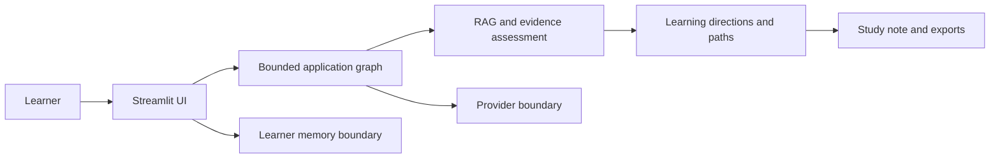
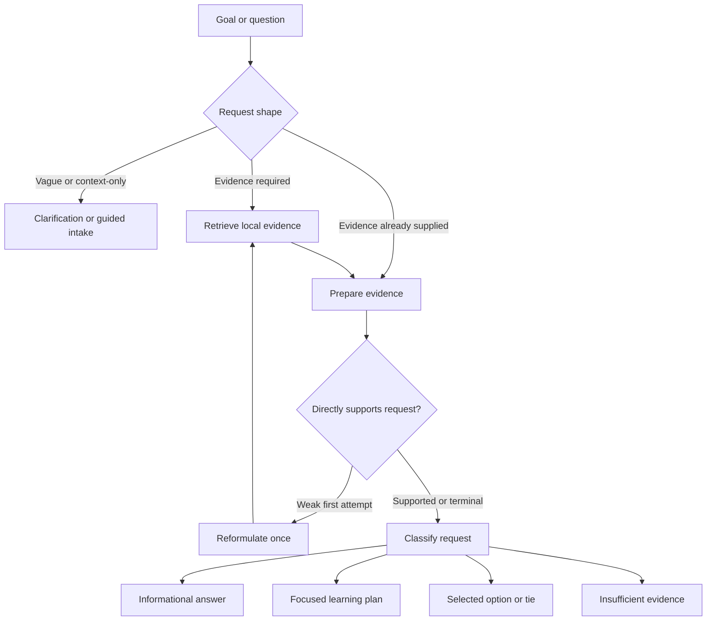

# Architecture

This document describes the current repository implementation. It does not
claim that every path has been exercised in the current documentation phase.

Cognivia is a local Python and Streamlit application for turning noisy learning
goals into evidence-aware next steps. Its primary Noise-to-Signal workflow
combines bounded graph orchestration, local corpus loading, provider-backed
embeddings when configured, local Qdrant retrieval, evidence assessment,
learning-path helpers, reflection notes, exports, and an optional learner-memory
boundary.

## High-level system

## System boundaries

| Concern | Current ownership |
| --- | --- |
| Streamlit composition, presentation, and interaction | `app.py` and `frontend/` |
| Application orchestration | `tools/noise_to_signal_graph.py` |
| Retrieval and corpus loading | `rag/` |
| Provider selection and model access | `tools/provider_config.py`, `openrouter_client.py`, and provider-aware RAG modules |
| Learner memory | `memory/` |
| Input-hygiene helpers | `security.py` |
| Evaluation definitions and evaluators | `rag/evaluation.py` |
| Local knowledge base | `data/knowledge_base/` |

`app.py` is the Streamlit composition root. In addition to UI assembly and
session-state handling, it retains some workflow, export-building, and
persistence coordination. Retrieval, provider configuration, memory-store
implementations, and evaluation have distinct modules, but the current
separation is pragmatic rather than complete.

## Product modes

`app.py` exposes three application modes: Noise-to-Signal Agent, AI Skill
Compass, and Interview Coach. Noise-to-Signal is the primary evidence-aware
workflow. The other modes share the Streamlit application shell but retain
their own interaction paths.

## Noise-to-Signal flow

The graph is assembled from explicit nodes that:

1. reset retrieval state;
2. gather clarification context and shape the request;
3. retrieve and assess evidence;
4. reformulate once when the first retrieval is insufficient;
5. classify the request deterministically, with an optional model classifier
   for ambiguous cases; and
6. route to an answer, clarification, plan, comparison, or insufficient-
   evidence response.

The graph uses an in-process checkpoint saver. This supports graph state during
the running process; it is not a claim of durable conversation persistence
across deployments.

Vague or context-only goals route to clarification or guided intake. Other
clear requests use the direct-decision path. Retrieval relevance is separate
from direct support: after score-threshold filtering, the graph assesses
whether available evidence supports the particular request. Weak,
unsupported, or out-of-scope requests can end in a low-evidence or
`insufficient_evidence` outcome rather than an unsupported recommendation.

Current decision statuses include:

- `needs_clarification` for a request that lacks enough decision context;
- `informational` for a directly supported explanatory request;
- `single_focus` for one sufficiently supported learning topic;
- `selected` or `tie` for comparison outcomes; and
- `insufficient_evidence` when evidence cannot support the requested result.

The workflow can reformulate an insufficient retrieval query once and retrieve
again once. It does not loop indefinitely or act as an open-ended autonomous
agent.

## Retrieval and grounding

```mermaid
flowchart LR
    KB[data/knowledge_base] --> Load[Recursive Markdown/PDF loader]
    Load --> Split[Token-aware chunks]
    Split --> Meta[Heading and provenance metadata]
    Meta --> Embed[Configured embeddings]
    Embed --> Q[Local Qdrant index]
    Q --> Relevant[Relevance-threshold candidates]
    Relevant --> Support[Direct-support assessment]
    Support --> State[Evidence-aware outcome]
```

The corpus loader recursively accepts Markdown and PDF files from
`data/knowledge_base/`; this is also the default PDF root. Markdown files are
classified from their corpus path and may supply approved provenance fields
from their leading metadata. PDFs are loaded page by page. Empty files or
pages do not become documents.

`rag/splitter.py` uses `RecursiveCharacterTextSplitter` with a token-count
length function backed by `tiktoken` and a deterministic byte-tokenizer
fallback. Markdown is divided into heading sections before chunking. Chunks
retain source, source type, filename, page where applicable, chunk index,
heading, heading path, section level, and available provenance fields such as
document role, source authority, publisher, year, title, topics, and verified
source URL.

The retriever uses a locally persisted Qdrant index. Its reuse check records a
manifest of each source path, size, and modification time, along with an index
schema version and embedding identity (provider, model, and base URL). This
detects manifest, schema, and embedding-identity changes; it is not a
content-hash or byte-level integrity check. Retrieval applies the configured
relevance threshold; the current default is `0.75`.

Generated responses receive assessed evidence and provenance through the graph
state. Exact citation appearance and response quality remain **PENDING manual
and evaluation verification**.

Creating or querying the index requires an API key for the selected
OpenAI-compatible embedding provider. Offline mode therefore supports
deterministic application paths but does not provide evidence-backed retrieval;
the graph records provider-configuration retrieval failure rather than treating
it as evidence.

### Relevance, support, and evidence state

These are deliberately different concepts:

- **Retrieval relevance** determines whether a candidate clears the configured
  similarity threshold.
- **Direct support** asks whether retrieved material answers the actual request
  shape, including whether every compared option has support.
- **Evidence state** communicates how the result may be used: evidence-backed,
  profile- or context-based, low-evidence, out-of-scope, or insufficient.

A relevant chunk can still fail the direct-support check. Conversely,
profile-based or deterministic guidance may remain useful when it is labeled
accurately and is not presented as retrieved evidence. These safeguards reduce
unsupported recommendations; they do not prove correctness or eliminate
hallucinations.

## Provider boundary

Provider configuration supports `offline`, `openai`, and `openrouter`.
When no provider is explicitly selected, configuration chooses OpenRouter only
when its key is present; otherwise it stays offline. An OpenAI key alone does
not implicitly select OpenAI. Configuration and runtime-status inspection are
implemented without making a model request.

Provider capability can differ by model support, structured-output behavior,
latency, cost, failures, and embedding/index compatibility. The implementation
does not establish equivalent behavior across providers.

| Mode | Configuration boundary | Current limitation |
| --- | --- | --- |
| `offline` | No provider secret required | No provider-backed generation or embedding-based RAG |
| `openai` | Explicit selection plus `OPENAI_API_KEY` | Live behavior, cost, and model capability depend on the configured service |
| `openrouter` | Explicit selection, or legacy selection when its key exists | Live behavior, cost, model support, and embedding compatibility may vary |

An OpenAI key alone does not implicitly select OpenAI. Configuration and
runtime-status inspection do not make a model request. No paid provider call
was made for this documentation recovery; live provider behavior remains
**PENDING verification**.

## Input hygiene and trust boundaries

`security.py` provides basic length checks and phrase-based input hygiene for
selected user-entered fields. It is not production-grade prompt-injection
protection, content moderation, authentication, authorization, or a complete
trust boundary. User input and corpus content must still be treated as
untrusted at provider, persistence, and display boundaries.

## Memory, state, and exports

Learner memory is accessed through a store boundary. A configured
`DATABASE_URL` selects the PostgreSQL store; otherwise the null store is
used. The PostgreSQL schema must already exist; selecting the store does not
create or migrate it. The PostgreSQL memory foundation is append-only, and its
current operations fail softly by logging the failure and returning an empty or
`None` result. Persistence is therefore best-effort rather than a confirmed
durability guarantee. The null store supplies no durable history. Export
sanitization is implemented at the memory boundary.

The Streamlit layer implements namespaced session state, Focus Mode entry and
exit, a new-search reset, and exports for learner memory, notes, and full
learning plans. Their end-to-end browser behavior remains **PENDING manual
verification**.

The PostgreSQL store records normalized profile snapshots and learning events
through the memory-store interface. The null store returns no durable profile
or event history. In-process LangGraph checkpoint memory supports graph state
during the running process, but it does not establish durable conversation
persistence across processes or deployments.

## UI modes and export boundary

The Streamlit application exposes three modes:

- **Noise-to-Signal Agent** provides the primary evidence-aware workflow,
  guided intake, result views, learning paths, Study notes, and Focus Mode.
- **AI Skill Compass** retains a separate skill-development interaction path.
- **Interview Coach** retains a separate interview-practice interaction path.

The Noise-to-Signal surface can export learner-memory JSON, reflection Markdown
and JSON, and a full learning-plan Markdown file when the relevant state is
available. Memory export sanitization removes full-text and secret-like fields
at the memory boundary. Export existence is not a claim that generated content
is authoritative, complete, or production-ready.

## Architectural trade-offs and limitations

- Streamlit supports rapid local iteration, but its rerun and widget-identity
  model requires explicit session-state handling and is not evidence of a
  production frontend architecture.
- Local Qdrant is the current vector store. The path/size/mtime manifest detects
  a useful class of changes, but it is not a content-integrity guarantee and
  local embedded storage can impose concurrency constraints.
- The curated corpus improves inspectability while limiting coverage. Valid
  learning questions may still lack direct support.
- Deterministic request shaping and learning-direction helpers make behavior
  more inspectable, but they are not live labor-market intelligence.
- PostgreSQL memory is an optional append-only foundation, not complete note
  CRUD or a production-grade multi-user memory system. It requires a prepared
  schema and does not currently surface every persistence failure in the UI.
- The deterministic retrieval evaluator checks source names and metadata; it
  does not inspect generated answers or establish end-to-end answer quality.

## Deployment status

This repository documents local Streamlit execution. No production hosting,
availability, scalability, or deployment claim is established by the current
evidence.

Production readiness would require separately verified decisions and controls
for persistent storage, Qdrant/index lifecycle, filesystem behavior, secret
management, startup and resource limits, authentication, authorization,
multi-user privacy isolation, observability, backups, rate limiting, and
recovery. Browser behavior and public deployment have not been validated in
this documentation recovery.

See [Testing](testing.md), [Evaluation](evaluation.md), and
[Sources and provenance](sources.md) for the evidence limits around this
architecture.
