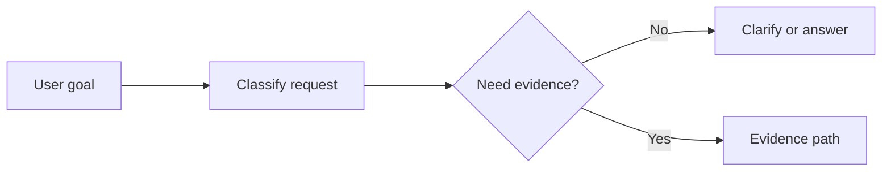
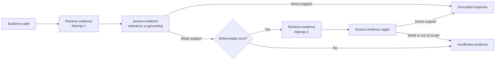

# Historical Project Presentation Outline

> Historical context: this is the Sprint 3 presentation outline. For the
> current Cognivia demo, use [demo-script.md](demo-script.md) and the
> [technical review guide](capstone-reviewer-guide.md).
> The current demo also includes recommendation explanations, numbered learning
> direction schemas, persistent path selection, mini notebook notes, compact
> runtime/provider messaging, and restored icon-based background controls.

## 1. One-sentence pitch

Skill Compass turns AI learning noise into one evidence-grounded next step.

More technical version:
Noise-to-Signal is a bounded Agentic RAG workflow that helps AI engineers
choose a learning focus using retrieved evidence, evidence assessment, and
fail-closed behavior.

## 2. Problem

- AI engineers face too much learning noise.
- There are too many tools, frameworks, papers, roadmaps, and job-market
  signals competing for attention.
- Generic LLM advice can sound useful even when it is not grounded in real
  evidence.
- The real problem is not only answering questions. It is deciding what to
  learn next with evidence strong enough to justify the recommendation.

Speaker note:
I would frame this as a decision problem, not just a chatbot problem. The risk
is not only hallucinated facts. It is confident but weak learning advice.

## 3. Solution

- Skill Compass is the brand, and the product position is an AI Engineer
  Compass.
- Its main workflow is Noise-to-Signal: an evidence-grounded decision assistant
  powered by bounded Agentic RAG.
- A user goal can end in one of four outcomes:
  recommendation or study plan,
  informational answer,
  clarification request,
  insufficient evidence.
- The system does not force an answer when the evidence is weak or the request
  is outside scope.

Speaker note:
That last point is important. A good outcome is sometimes a refusal to invent a
plan.

## 4. Presentation-friendly workflow diagram

- Max 2 retrieval attempts.
- Max 1 query reformulation.
- Insufficient evidence is a valid outcome.
- Retrieval relevance is not the same as groundedness.

Speaker note:
This is where I would say Agentic RAG here is bounded. The graph can make a few
controlled retrieval decisions, but it does not have unlimited autonomy.

## 5. Architecture explanation

- Streamlit is the UI layer. It collects the user goal and displays the final
  result, retrieved evidence, and decision trace.
- LangGraph orchestrates the workflow. It decides which step runs next and when
  to stop.
- Qdrant acts as the vector store for semantic retrieval over the local
  knowledge base.
- The graph decides when retrieval is needed instead of retrieving for every
  request.
- Evidence assessment checks whether the retrieved chunks directly support the
  answer or recommendation.
- If evidence is weak, the graph can reformulate once and retry.
- If support is still weak, out of scope, or not direct enough, the system
  fails closed with insufficient evidence.

Key explanation:
Agentic RAG here does not mean unlimited autonomy. It means the graph can make
bounded decisions about retrieval, evidence assessment, reformulation, and
terminal outcomes.

## 6. Data

- The local knowledge base contains AI engineering, job-market, and skill
  development documents.
- Documents are chunked, embedded, and retrieved semantically through the local
  vector store.
- Retrieved evidence is shown in the UI so the result is inspectable.
- The corpus is intentionally limited, which is one reason insufficient
  evidence is sometimes the correct output.

Speaker note:
I would be explicit that the corpus is useful for a Sprint 3 review demo, but still
small enough that conservative fail-closed behavior matters.

## 7. Evaluation

- The project includes unit tests and graph tests for routing, evidence
  handling, memory behavior, and fail-closed outcomes.
- It also includes Streamlit AppTests for inspection-oriented UI behavior.
- Manual evaluation is still part of the process because the final experience
  includes interaction, explanation, and technical interpretation.
- Current smoke testing should include the restored background icon
  controls and learning direction selection flow.
- Screenshots can support the presentation if the live demo is unstable.

Representative cases:

1. `What should I learn next?`
   Expected and observed behavior: clarification request.
   Why it matters: it avoids random generic study plans.

2. `Should I learn LangGraph or RAG evaluation?`
   Expected and observed behavior: selects RAG evaluation with sufficient
   evidence.
   Why it matters: it demonstrates actual decision support, not just retrieval.

3. `Tacos al pastor`
   Expected and observed behavior: insufficient evidence and out-of-scope
   behavior.
   Why it matters: it shows fail-closed groundedness instead of a false study
   plan.

Possible screenshot references:
- [Comparison demo](demo-screenshots/02-comparison-rag-evaluation-decision-trace-evidence.png)
- [Tacos insufficient evidence](demo-screenshots/03-tacos-insufficient-evidence.png)
- [Tests green](demo-screenshots/04-tests-green.png)

## 8. Main technical challenge

Core story:
`Retrieval relevance is not the same as groundedness.`

- Retrieval relevance means a document looks related to the query.
- Groundedness means the final answer is directly supported by the retrieved
  evidence.
- The `Tacos al pastor` bug exposed this gap clearly.
- The system could retrieve generic AI or job-market evidence, but that did not
  support an out-of-domain request.
- The fix was to require AI-engineering domain relevance or direct evidence
  support for single-focus requests.
- That change prevents false study plans and makes insufficient evidence a
  legitimate result.

Speaker note:
This is probably the strongest technical story in the review because it shows a
real failure mode, a precise fix, and a better safety boundary afterward.

## 9. Ethics and limitations

- Privacy: the project uses local documents and does not need unnecessary
  personal data for the main workflow.
- Bias: job-market and skills documents can reflect market bias, so the system
  can inherit bias from the source set.
- Hallucination risk: reduced through evidence assessment and the ability to
  return insufficient evidence.
- Limitation: the corpus is small, evaluation is still partly qualitative, and
  production hardening is future work.
- LangSmith tracing is available as an optional local observability feature in
  this Sprint 3 state, but it is not required for normal tests or offline-safe
  runs.

## 10. Demo script

Demo 1: Vague request

Prompt:
`What should I learn next?`

Show:
- Clarification request.
- Guided intake.
- Recommendation explanation, career path explanations, skill gap explanations.
- Numbered learning direction schemas and `Choose this path`.

Demo 2: Comparison

Prompt:
`Should I learn LangGraph or RAG evaluation?`

Show:
- Selected focus.
- Evidence quality.
- Retrieved evidence.
- Decision trace.
- Technical details behind diagnostic expanders.

Demo 3: Groundedness and safety

Prompt:
`Tacos al pastor`

Show:
- Insufficient evidence.
- Out-of-scope or not directly supported behavior.
- No false study plan.

Fallback note:
If the live demo fails, use screenshots from `docs/demo-screenshots`, especially
`02-comparison-rag-evaluation-decision-trace-evidence.png` and
`03-tacos-insufficient-evidence.png`.

## 11. 10-minute timing plan

- 0:00-1:00 Problem
- 1:00-2:00 Solution
- 2:00-4:00 Architecture and workflow
- 4:00-5:30 Data and RAG
- 5:30-7:00 Evaluation
- 7:00-8:30 Main challenge and Tacos bug
- 8:30-9:30 Demo or screenshots
- 9:30-10:00 Next steps

Speaker note:
If time gets tight, shorten the architecture explanation before cutting the bug
story or the demo. Those two parts carry the most signal.

## 12. Q&A preparation

Why LangGraph?
Because I needed explicit workflow control, bounded routing, and stateful
orchestration instead of a single prompt chain.

What makes this Agentic RAG?
The graph can decide whether to retrieve, assess evidence, reformulate once,
retry, and choose a terminal outcome.

How do you avoid hallucinations?
I reduce them by requiring direct evidence support and by allowing
insufficient-evidence outcomes instead of forcing an answer.

Why max 2 retrieval attempts?
It keeps the behavior understandable, bounded, and easier to review and test.

Why can the system return insufficient evidence?
Because weak or out-of-scope evidence should not be turned into confident study
advice.

Why Qdrant or a vector DB?
It gives semantic retrieval over the local knowledge base and fits the bounded
RAG workflow well.

What was the hardest bug?
The groundedness bug where relevant-looking evidence could still support a bad
recommendation, especially in the Tacos case.

What would you improve next?
I would expand the corpus, strengthen evaluation, and add better observability
around retrieval and evidence decisions.

What are the ethical risks?
Bias in the source material, overtrust in AI guidance, and the risk that users
read a recommendation as more certain than it really is.

Why is retrieval relevance not the same as groundedness?
Because a document can mention a related topic without directly supporting the
actual answer or recommendation.

## 13. Final closing sentence

The main outcome is not just that the app gives recommendations, but that it
knows when not to recommend.
